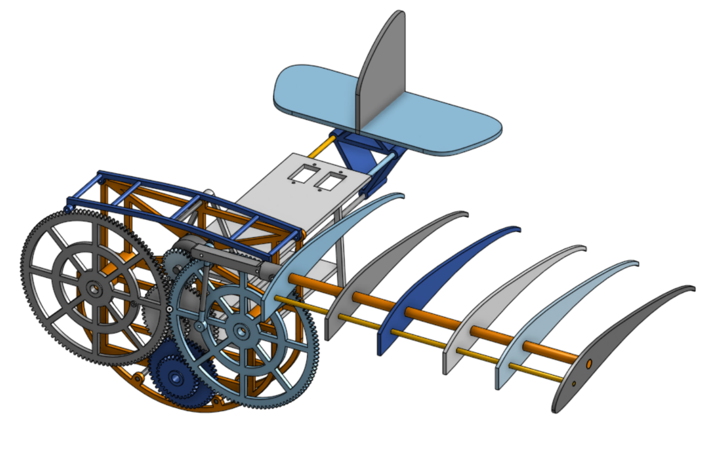

Hello,
So I am trying to make a ornithopter what it does is it flap its wing to generate life ( aka a mechinal bird) 

The Goal of the project: to build a lightweight ornithopter capable of stable powered flight using a simple flapping mechanism.

The project will be set up in phases.

Phase 1 
This is the prototyping phase of the wing movement mechanism. I will be designing a body that takes the rotating motion from a motor to move the wings up and down. I will be looking for reliability, strength, and efficiency.

Phase 2

Here I will be designing the wing. I need to make it lightweight. I will also be testing it with the gear mechanism and measuring how much lift it produces so I can determine my design constraints for the tail.
Phase 3 – Adding the Tail and Other Electronics

This is where I will be adding the tail and electronics together. I will also be doing some early test flights if all goes to plan. My goal is to have a clean mechanical system. The tail will look like an airplane tail, as I am currently just focusing on the flapping mechanism.

Phase 4

This phase is for debugging and testing. I want to aim for reliability and simplicity, and I will be conducting my own test flights as well.

Current Progress (Phase 1)
I am currently in Phase 1 and have decided to use a crankshaft-based mechanism for wing motion.
I am using this simulation tool to help calculate and visualize the wing path:
https://www.desmos.com/calculator/iuprdl6sxk
My motor has a KV rating of 1700, and I will need a gear reduction of approximately 21.24:1. This may change during testing, but for now I am satisfied with the 
I have just submitted my project for funding so I am hoping it will go though. 
